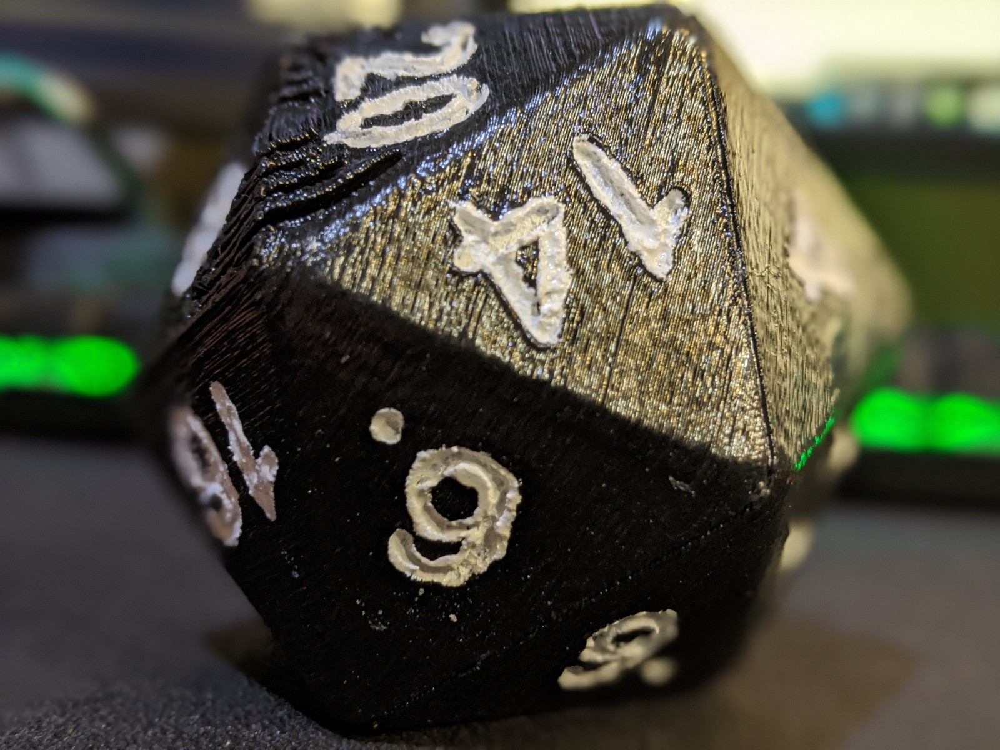

# Talking D20 Project

## Overview

The inspiration for this project came from the this [Adafruit post](https://learn.adafruit.com/talking-d20-20-sided-gaming-die). However, due already having a few different components in my inventory, I decided to switch a few things up. I already possessed the ADXL345 for the accelerometer as well as the DFPlayer Mini that I used to replace both the FX Mini Sound board as well as the 2.5W Audio Amplifier. Furthermore, I used this [MakerFocus 2A Lipo charger](https://www.amazon.com/gp/product/B07PZT3ZW2) instead of the Lipo Backpack. Lastly, I used one of my Arduino Nano's instead of the recommended Adafruit Pro Trinket.

## Build Notes

For the most part I followed along with the aforementioned tutorial but I did have to make adjustments due to using different components. The 3D print went fine with the provided .STL and I went with black PLA. My print wasn't the cleanest but I was having to rely on a printer at the local Maker's Place. I have since purchased a personal 3D printer and will have more leway to adjust settings to further dial-in the settings. After that I tested gluing in the mentioned magnets from K&J Magnetics. I can attest, those magnets are very powerful and two on each side is plenty. I started experimenting with soldering contacts directly to the magnet (which also reduced the magnetic strength) because I wanted to find a cleaner way to provide the connection to the speaker. However, I thought of that idea too late and if I decide to make another I will try this out and provide details. Next, I was able to leverage the screw points for the accelerometer and installed that in accordance to the guide. After which I was able to place the Arduino Nano in the same place for the Trinket Pro but had to use super glue to hold it in. After this, I glued the DFPlayer Pro on top of the LiPo battery and the MakerFocus charger on top of the DFPlayer. Once these were secured together I glued them down beside the Nano. Lastly, in the place of the switch, I ended up building a coil circuit along with a 2N3904 transistor to provide a wireless triggering capability with the MakerFocus charger. This component has a "KEY" pad that when connected to ground will provide battery power to the circuit. The reasoning behind this was two-fold. For one, the charger requires a constant Amp draw than my system is pulling and therefore turns off after 30 seconds of idle use. Secondly, I was tired of opening the D20 in order to turn on/off since the magnets require a decent pull to separate and I want to reduce the chance of ripping cables off their contacts. Therefore, I can now turn on the D20 by placing it with the 3 face down onto a wireless charger for a quick moment and only need to open to charge the battery. Lastly, I decided on painting the numbers using white acrylic paint but opted for mixing in bluegreen glow-in-the-dark pigments to give it that next level look.
